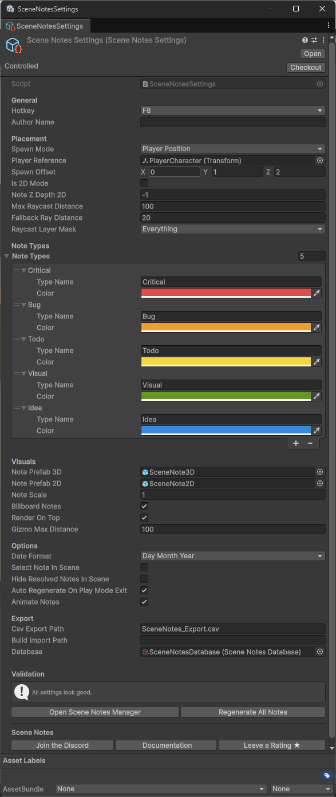

# Configuration

All Scene Notes settings are stored in a single ScriptableObject asset located at `Assets/SceneNotes/Settings/SceneNotesSettings.asset`. Select it in the Project window to view and edit the configuration in the Inspector.

{ .image-card }

## General

### Hotkey

The key that triggers note creation during play mode. Default is F8 (KeyCode 289). Choose a key that does not conflict with your game's controls.

### Author name

The name attached to each note you create. If left empty, your operating system username is used automatically. For team workflows, each team member should set their own author name so notes can be attributed correctly.

## Placement

### Spawn mode

Controls where notes appear when created. Three options:

| Mode | Description | Best for |
|------|-------------|----------|
| Player Position | Offset from the player Transform (or camera fallback) | FPS, third-person, platformers, RPGs |
| Cursor Raycast | Raycast from the mouse cursor through the camera | RTS, city builders, god games, top-down |
| Screen Centre Ray | Raycast from the centre of the screen | VR, cursor-locked FPS, reticle-based games |

See [Placement modes](spawn-modes.md) for detailed guidance on each mode.

### Player reference

The Transform of your player character. Only used in Player Position mode. If left empty, Scene Notes looks for a GameObject tagged "Player" first, then falls back to Camera.main.

### Spawn offset

A Vector3 offset applied in Player Position mode. Controls where the note spawns relative to the player. Default is (0, 1, 2) — one unit above and two units in front of the player.

- X: left/right offset
- Y: up/down offset
- Z: forward/backward offset

### 2D mode

Enable for 2D (orthographic) projects. Changes the placement to use `ScreenToWorldPoint` instead of 3D raycasting and spawns the 2D note prefab instead of the 3D one.

### Note Z depth (2D only)

The Z world position assigned to notes in 2D mode. Negative values place notes in front of your game art. Default is -1.

### Max raycast distance

Maximum distance the placement raycast travels when searching for a surface. Default is 100 units.

### Fallback ray distance

When the raycast does not hit any surface (for example, pointing at the sky), the note spawns at this distance from the camera along the ray direction. Default is 20 units.

### Raycast layer mask

Controls which layers the placement raycast checks against. Default is Everything. Exclude layers that should not receive notes (UI, trigger volumes, invisible colliders).

## Note types

A list of categories available when creating a note. Each type has a name and a colour used for the note header strip and the Scene Notes Manager filter pills.

Default types:

| Type | Colour | Hex |
|------|--------|-----|
| Critical |Red | #E24B4A |
| Bug |Orange | #EF9F27 |
| Todo |Yellow | #F5D63D |
| Visual |Green | #639922 |
| Idea |Blue | #378ADD |

!!!tip
    You can add, remove, rename, and recolour types freely. See [Note types](note-types.md) for details.

## Visuals

### Note prefab 3D

The prefab spawned for notes in 3D projects. Created automatically by the setup wizard. Must contain a SceneNoteObject component. You can replace this with a custom prefab if you want a different visual style.

### Note prefab 2D

The prefab spawned for notes in 2D projects. Same requirements as the 3D prefab. Uses a slightly smaller layout optimised for orthographic cameras.

### Note scale

Uniform scale applied to every spawned note object. Default is 1. Increase for large open-world scenes where notes appear small, decrease for tight indoor environments.

### Billboard notes

When enabled (default), note objects rotate each frame to face the active camera. In the editor, they face the Scene view camera. In play mode, they face Camera.main. Disable if you want notes at a fixed rotation.

### Render on top

When enabled (default), note objects are drawn on top of all geometry using ZTest Always, so they are visible through walls and objects. Uses a custom NoteUnlit shader with per-material ZTest control. Disable if you prefer notes to be occluded by geometry.

Changes to this setting are detected at runtime and applied to all existing notes automatically — no need to regenerate.

### Gizmo max distance

Maximum distance from the Scene view camera at which note gizmos (coloured spheres and labels) are drawn. Default is 100 units. *(Feature not yet implimented)*

## Options

### Date format

Controls how dates are displayed on notes and in the Manager window. Two options:

| Format | Example |
|--------|---------|
| DayMonthYear (default) | 4:00pm  30 Mar 2026 |
| MonthDayYear | 4:00pm  Mar 30, 2026 |

Times are converted from UTC to your local timezone automatically.

### Select note in scene

When enabled, clicking a note in the Scene Notes Manager window also selects its GameObject in the Scene view and Hierarchy. Useful for inspecting or manually moving individual notes. Disabled by default.

### Hide Resovled Notes In Scene

When enabled, hides all resolved notes in the scene view.

### Auto-regenerate on play mode exit

When enabled (default), Scene Notes automatically destroys runtime note objects and rebuilds them from the database as proper edit-mode prefab instances when you exit play mode. This ensures notes display correctly with all visual properties (colours, text, render settings) intact.

### Animate Notes
When enabled (default), Scene Notes will play a short bouncy animation when spawned.

## Export

### CSV export path

File path for CSV exports, relative to the project root. Default is `SceneNotes_Export.csv`. See [Exporting notes](exporting.md).

### Build import path

Path to look for JSON files from standalone builds. Leave empty to auto-detect from `Application.persistentDataPath`. See [Standalone builds](build-workflow.md).

### Database

The SceneNotesDatabase asset that stores all note data. Created and linked automatically by the setup wizard. You can create additional databases if you need separate note sets for different purposes.

## Validation

The bottom of the Settings Inspector displays a validation section that checks for common configuration issues and shows warnings or errors for anything that needs attention. If everything is correctly configured, it displays "All settings look good."

Quick-action buttons are also available:

- Open Scene Notes Manager — opens the editor window
- Regenerate All Notes — rebuilds note objects from the database

## Community links

The Settings Inspector includes links at the bottom:

- Join the Discord — community support channel
- Documentation — this documentation site
- Leave a Rating — link to the Asset Store review page
