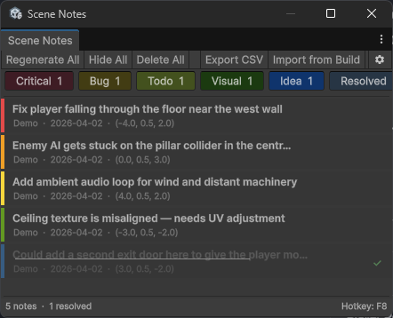

# Scene Notes Manager

The Scene Notes Manager is an editor window for browsing, filtering, and managing all notes in your scene.

Open it from: Tools → Scene Notes → Scene Notes Manager, or press Ctrl+Shift+N (Cmd+Shift+N on Mac).

## Toolbar

The toolbar at the top of the window provides quick actions:

### Regenerate all

Destroys all existing note objects in the scene and rebuilds them from the database as proper edit-mode prefab instances. Use this if note objects have been accidentally deleted, moved, or lost their visual properties. This does not create or delete any data — it only rebuilds the visual objects.

### Hide all

Removes all note objects from the scene without affecting the database. Notes still exist in the ScriptableObject and can be brought back with Regenerate All. Useful when notes clutter the Scene view during level design.

### Delete all

Permanently removes all notes for the current scene from the database and destroys their scene objects. A confirmation dialog appears showing the count — this action cannot be undone (though it supports Undo in the editor).

### Resolve / unresolve selected

When one or more notes are selected, a green Resolve Selected button appears. Click to mark all selected notes as resolved (or unresolve them if they are already resolved). The button label changes based on the current state of the selection.

### Delete selected

When one or more notes are selected, a red Delete Selected button appears with the count. Click to permanently delete all selected notes after a confirmation dialog.

### Export CSV

Exports all notes in the current scene to a CSV file. The export respects the current type filters — if you have hidden certain types, only visible types are exported. See [Exporting notes](exporting.md).

### Import from build

Opens a file picker to select a JSON file from a standalone build. Notes are imported and merged into the database with duplicate detection. See [Standalone builds](build-workflow.md).

### Settings button

The gear icon on the far right opens the SceneNotesSettings asset in a property editor window.

## Filter bar

Below the toolbar, coloured pill buttons let you filter notes by type. Each pill shows the type name and the count of notes of that type in the current scene.

Click a pill to toggle that type's visibility. Active types show at full opacity, hidden types are dimmed. Filtering affects both the note list and the 3D note objects in the scene.

A separate Resolved pill toggles visibility of resolved notes.

## Note list

The main area is a scrollable list of all notes in the current scene that match the current filters. Each row shows:

- A coloured strip on the left edge indicating the note type
- The description text (truncated to 55 characters with ellipsis)
- The author name, date, and world position coordinates
- A checkmark badge for resolved notes
- A visual strikethrough on resolved note descriptions

### Clicking notes

Plain click on a note selects it and flies the Scene view camera to its world position. The camera zooms to 2 units away from the note.

Ctrl+click (Cmd+click on Mac) toggles individual notes in and out of the selection without deselecting others. This lets you build up a multi-selection.

Shift+click selects a range from the last clicked note to the current one, including all notes in between.

If Select Note in Scene is enabled in settings, clicking a note also selects its GameObject in the Hierarchy and Scene view.

Click empty space below the note list to deselect all notes.

### Right-click context menu

Right-click any note to access:

When a single note is right-clicked:

- Mark as Resolved / Mark as Unresolved — toggles the resolved state
- Fly to Note — moves the Scene view camera to this note
- Copy Position — copies the world position as a `new Vector3(x, y, z)` string to the clipboard, ready to paste into code
- Delete — removes this note after confirmation

When right-clicking a note that is part of a multi-selection:

- Mark N Selected as Resolved
- Mark N Selected as Unresolved
- Delete N Selected Notes
- Plus the individual note actions below the separator

## Bottom bar

The bottom of the window shows:

- Total note count and resolved count for the current scene
- The current hotkey binding (from settings)

## Notes are scene-specific

The Manager only shows notes for the currently active scene. Switch scenes in Unity and the list updates automatically. Notes for other scenes remain in the database — they are just not displayed until that scene is active.

## Undo support

Delete, resolve, and unresolve operations support Unity's Undo system. Press Ctrl+Z (Cmd+Z on Mac) after a delete or resolve operation to reverse it.
