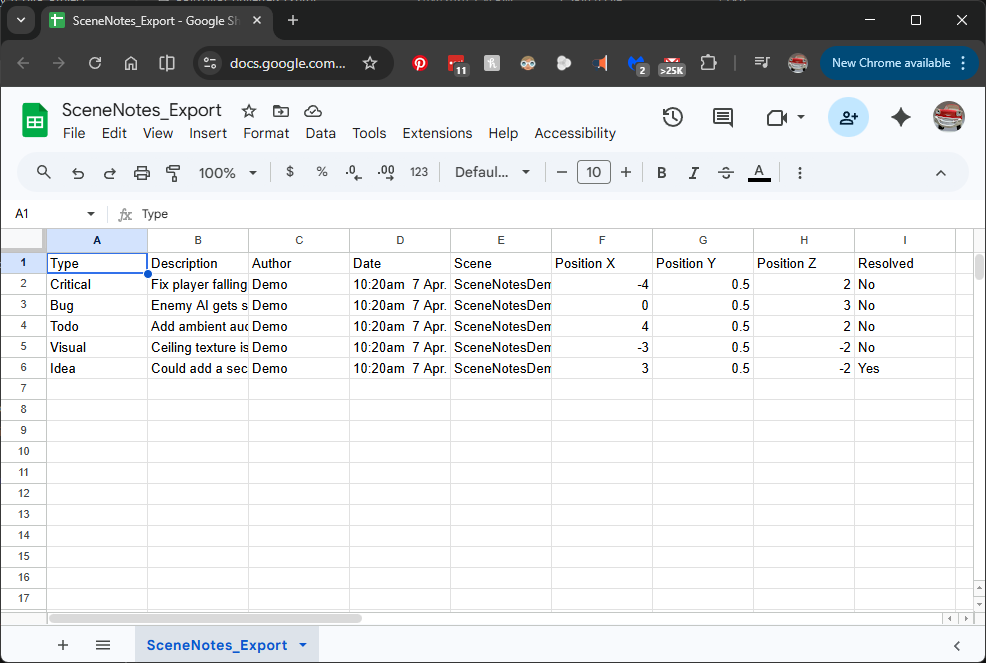

# Exporting notes

Scene Notes supports two export formats: CSV for project management tools and JSON for standalone build workflows.

{ .image-card }

## CSV export

### Exporting from the editor

1. Open the Scene Notes Manager window
2. Click Export CSV in the toolbar
3. The file is saved to the path configured in settings (default: `SceneNotes_Export.csv` next to your Assets folder)

The export respects the current type filters. If you have hidden certain types in the filter bar, only visible types are included in the export. To export everything, make sure all type filters are active.

### CSV format

The exported file uses RFC-4180 compliant CSV formatting. Fields containing commas, newlines, or double-quotes are properly escaped.

Columns:

| Column | Description | Example |
|--------|-------------|---------|
| Type | Note type name | Critical |
| Description | Full note text | Player falls through floor |
| Author | Creator's name | Chris |
| Date | Formatted date and time | 4:00pm  30 Mar 2026 |
| Scene | Unity scene name | Level_01 |
| Position X | World X coordinate | -12.400 |
| Position Y | World Y coordinate | 0.000 |
| Position Z | World Z coordinate | 33.700 |
| Resolved | Yes or No | No |

The date format respects the Date Format setting (DayMonthYear or MonthDayYear) and converts UTC timestamps to your local timezone.

### Export scope

CSV export includes notes from the currently active scene only. To export notes across all scenes, switch to each scene and export separately.

### Using with project management tools

The CSV is compatible with most tools:

- Trello — use a CSV import tool or Power-Up to create cards from rows
- Jira — use the built-in CSV import to create issues
- GitHub Issues — use a CSV-to-Issues script for batch creation
- Notion — import as a database with sortable and filterable columns
- Google Sheets / Excel — open directly for manual review and tracking

### Configuring the export path

The CSV Export Path field in settings accepts both relative and absolute paths. Relative paths are resolved from the project root (the folder containing your Assets folder). The default `SceneNotes_Export.csv` places the file next to your Assets folder.

## JSON export

JSON export is used primarily for the standalone build workflow — notes are automatically saved to JSON when a build quits. See [Standalone builds](build-workflow.md) for the full workflow.

JSON export can also be triggered manually from script:

```csharp
SceneNotesExporter.ExportJSON(settings);
```

This saves a timestamped JSON file to `Application.persistentDataPath` with the format `SceneNotes_[SceneName]_[Timestamp].json`.

Unlike CSV export, JSON export includes all notes in the database, not just the current scene. The file uses Unity's `JsonUtility` serialisation wrapped in a `NoteListWrapper` object.

## Importing JSON

See [Standalone builds — Importing notes from builds](build-workflow.md#importing-notes-from-builds) for details on importing JSON files into the editor database.
