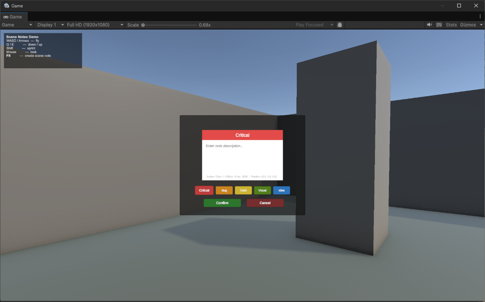

# Getting started

This guide walks you through setting up Scene Notes and creating your first note.

## Installation

1. Import the Scene Notes package from the Unity Asset Store
2. The package installs to `Assets/SceneNotes/`

## Setup wizard

Scene Notes includes a guided setup wizard that creates all required assets and prefabs for you. Run these steps in order from the Unity menu bar:

### Step 1: Create assets

Go to Tools → Scene Notes → 1. Create Assets

This creates:

- `Assets/SceneNotes/Settings/SceneNotesSettings.asset` — the main configuration file
- `Assets/SceneNotes/Settings/SceneNotesDatabase.asset` — the database that stores all note data
- Populates the default note types (Critical, Bug, Todo, Visual, Idea)
- Links the database to the settings automatically

!!! info 
    After running this step, the Settings asset is selected in the Inspector so you can review the configuration.

### Step 2: Create prefabs

Go to Tools → Scene Notes → 2. Create Prefabs

This creates:

- `Assets/SceneNotes/Prefabs/SceneNote3D.prefab` — the 3D sticky note prefab
- `Assets/SceneNotes/Prefabs/SceneNote2D.prefab` — the 2D sticky note prefab
- `Assets/SceneNotes/Prefabs/SceneNotesCanvas.prefab` — the runtime UI for note creation
- `Assets/SceneNotes/Materials/` — materials for note body and header (3D and 2D variants)

All prefabs are automatically linked to the settings asset.

### Step 3: Create demo scene (optional)

Go to Tools → Scene Notes → 3. Create Demo Scene

This creates a self-contained demo scene at `Assets/SceneNotes/Demo/SceneNotesDemo.unity` with:

- A simple environment (ground plane, pillars, crates, walls)
- A free-fly camera (WASD to move, mouse to look, Shift to sprint, Q/E for up/down)
- The SceneNotesCanvas prefab already placed in the scene
- Five pre-seeded demo notes (one of each type) placed at different positions
- One note pre-marked as resolved to demonstrate the resolved state

This is the fastest way to see Scene Notes in action and understand how it works.

## Adding Scene Notes to your own scene

1. Open your scene
2. Drag the SceneNotesCanvas prefab from `Assets/SceneNotes/Prefabs/` into the scene hierarchy
3. That's it — the prefab contains both the SceneNotesController and the SceneNoteCreator

!!! info 
    The controller uses `DontDestroyOnLoad` in play mode so it persists across scene changes.

## Configuring the player reference

If you are using Player Position spawn mode (the default), you need to tell Scene Notes where your player is:

1. Select the SceneNotesSettings asset
2. In the Placement section, drag your player GameObject into the Player Reference field
3. Optionally adjust the Spawn Offset (default is X:0, Y:1, Z:2 — slightly above and in front of the player)

If the Player Reference is left empty, Scene Notes falls back in this order:

1. Looks for a GameObject tagged "Player"
2. Falls back to Camera.main and places the note forward along the camera direction

!!! tip
    For games where the player object changes between scenes, use the tag-based fallback. Tag your player GameObject as "Player" in each scene and leave the Player Reference field empty.

## Creating your first note

1. Enter play mode
2. Play your game normally
3. Press the hotkey (default F8) when you spot something worth noting
4. The game freezes and the note creation panel appears
5. Type a description in the text field
6. Click a note type button to categorise it (the header colour changes to match)
7. Click Confirm — or press Escape to cancel

The note spawns as a colour-coded sticky note at your position. The game resumes automatically. Your cursor state (locked/visible) is restored to what it was before the note panel opened.

## Viewing notes after playtesting

When you exit play mode, Scene Notes automatically regenerates all your notes as scene objects (if Auto-regenerate on Play Mode Exit is enabled in settings).

To manage your notes, open the Scene Notes Manager:

- Go to Tools → Scene Notes → Scene Notes Manager
- Or press Ctrl+Shift+N (Windows) / Cmd+Shift+N (Mac)

Click any note in the list to fly the Scene view camera to its location. See [Scene Notes Manager](editor-window.md) for full details.

## Validating your setup

The SceneNotesSettings Inspector includes a validation section at the bottom that checks for common configuration issues:

- Missing database reference
- Empty note types list
- Missing note prefabs for the active mode (2D or 3D)
- Missing player reference when using Player Position mode
- Invalid raycast distance values
- Zero or negative note scale

If everything is configured correctly, you will see "All settings look good."

The Inspector also includes quick-action buttons:

- Open Scene Notes Manager — opens the manager window
- Regenerate All Notes — rebuilds note objects from the database
- Join the Discord / Documentation / Leave a Rating — community links

## Next steps

- [Configuration](configuration.md) — customise all settings
- [Placement modes](spawn-modes.md) — choose the right mode for your game type
- [Note types](note-types.md) — create custom note categories
- [Scene Notes Manager](editor-window.md) — the full editor window reference
- [Standalone builds](build-workflow.md) — set up QA workflows for builds
- [Exporting notes](exporting.md) — CSV and JSON export
