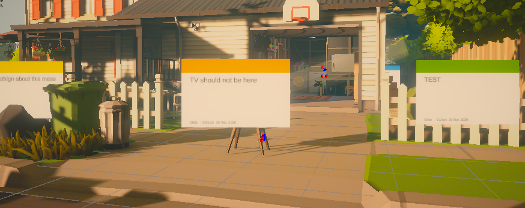

# Scene Notes

Drop contextual notes directly into your Unity scene during playtesting. Press a hotkey, describe the issue, and a colour-coded sticky note appears at that exact world position. Notes persist after play mode ends.

<!-- Add hero screenshot here: a game scene with several colourful sticky notes -->
<!--  -->

## What is Scene Notes?

Scene Notes is a Unity editor tool that lets you create spatial annotations while playtesting your game. Instead of alt-tabbing to a notepad or trying to remember where a bug was, you press a hotkey and drop a note right where the issue is.

When play mode ends, your notes are waiting in the scene. Click any note in the manager window and the camera flies straight to it.

## Key features

- Create notes during play mode with a single hotkey press
- Notes persist after play mode ends
- Three placement modes: player position, cursor raycast, and screen centre
- Works in both 2D and 3D projects
- Works in the Unity Editor and in standalone builds
- Colour-coded note types (critical, bug, todo, visual, idea)
- Fully customisable — add your own note types, colours, and hotkeys
- Scene Notes Manager window with filtering, sorting, and camera navigation
- Export to CSV for project management tools
- Import notes from standalone builds for QA workflows
- Auto-fills date, time, author, position, and scene name

## Quick start

1. Import Scene Notes into your Unity project
2. Open the Scene Notes Settings asset and configure your hotkey and spawn mode
3. Enter play mode and start playtesting
4. Press the hotkey (default F8) when you spot an issue
5. Type a description, pick a note type, and confirm
6. Exit play mode — your notes persist in the scene

For detailed setup instructions, see [Getting started](getting-started.md).

## Requirements

- Unity 2021.3 or higher
- Compatible with Built-in, URP, and HDRP render pipelines
- Works with 2D and 3D projects

## Support

- Discord: [https://discord.gg/DSUd2QcyHZ](https://discord.gg/DSUd2QcyHZ)
- Website: [www.chrisburns.com.au](http://www.chrisburns.com.au)
